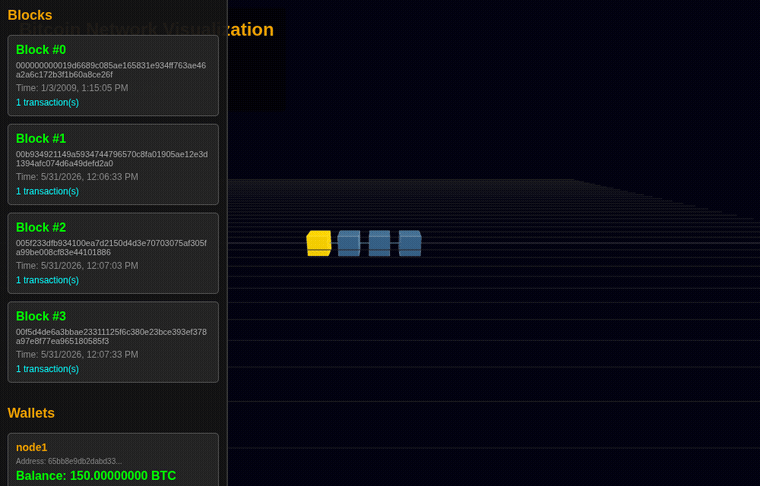

# Bitcoin v0.1 in Python

Python re-implementation of the original Bitcoin protocol from 2009. I'm
translating Satoshi's C++ code to understand how Bitcoin actually works — the
original v0.1 source is bundled in [`bitcoin-v0.1-source/`](bitcoin-v0.1-source/)
for side-by-side comparison.

The genesis block reproduces bit-for-bit
(`000000000019d6689c085ae165831e934ff763ae46a2a6c172b3f1b60a8ce26f`), which
proves the serialization, double-SHA256, merkle tree and script assembly are
correct.

## What's in it

- **Core protocol** — transactions, blocks, scripts, the script interpreter,
  double-SHA256 / RIPEMD160 / ECDSA (secp256k1), CompactSize serialization,
  merkle trees, proof-of-work + difficulty retargeting, UTXO/TxDB.
- **Chain** — block index, longest-chain selection and reorgs, orphan handling.
- **P2P networking** — the v0.1 wire protocol (version / getblocks / inv /
  getdata / block / tx / addr), so multiple nodes peer and **sync blocks**.
- **Mempool, wallet, mining.**
- **A 3D blockchain visualizer** (Three.js) served over HTTP.

## Architecture

The code is organised as a layered service architecture:

```
cryptogenesis/
  node.py            # single headless entry point (build services, run, /api)
  genesis.py         # the one genesis-block factory
  block.py chain.py transaction.py script…  # core protocol + chain engine
  crypto.py uint256.py serialize.py utxo.py # primitives
  network/protocol.py                       # the P2P engine
  mempool.py wallet.py mining.py            # mempool / wallet / miner engines
  events/            # EventBus (engine -> UI notifications)
  state/             # BlockchainState / WalletState / MempoolState
  services/          # Blockchain / Wallet / Mining / Network / Mempool services
```

`node.py` builds everything through `get_services(EventBus())`. The `state/`
classes are the single source of truth — thin, thread-safe facades over the one
chain / wallet / mempool engine (no duplicate stores), and the `services/` layer
orchestrates them.

## Quick start (single node)

```bash
pip install ecdsa
python3 -m cryptogenesis.node --node-id 1
```

The node boots the genesis block, starts mining, and serves a small JSON API on
`http://localhost:8081`:

- `GET /api/blockchain` — height + recent blocks
- `GET /api/wallet` — this node's wallet address + balance
- `GET /api/peers` — live peer connections (diagnostics)

Pass `--no-mining` to run as a sync-only follower, and
`--peers host:port,host:port` to connect to other nodes.

## Tests

```bash
pip install pytest
python3 -m pytest -q        # 133 passing
```

The suite pins the genesis hash, known-answer crypto/PoW vectors, the P2P
handshake/framing, and the single-source-of-truth invariants.

## Multi-node network with Docker

Runs 10 nodes on an internal Docker network plus the visualizer. **node1 mines;
node2–node10 are followers (`--no-mining`)**, so the whole network converges on a
single chain (in instant-mining test mode, multiple simultaneous miners would
just produce competing equal-length forks).

```bash
# Build and start the 10-node network + visualizer
docker compose up --build

# Open the 3D visualizer
#   http://localhost:8087

# Follow a node's logs
docker compose logs -f node1

# Stop everything
docker compose down
```

All ten nodes converge on node1's chain and track each new block; the visualizer
aggregates the chain and per-node wallets.

> **Note:** storage is in-memory — all chain/wallet/mempool state is lost when a
> container stops, and each node starts fresh from genesis and re-syncs from
> peers. The host-port mappings in `docker-compose.yml` assume those ports are
> free; if they collide, remove the `ports:` blocks (the nodes peer over the
> internal network regardless).

## Visualization



The visualizer (`visualization_server.py` + `static/visualization.js`) renders the
chain as a 3D Three.js scene and polls the nodes' `/api` endpoints for live
height, blocks and wallet balances.

## Status

This is for **learning, not production**. Working: the core protocol (genesis
verified), chain with reorgs, the P2P stack, single-node and multi-node block
sync, mining, mempool and wallet. Deliberately simple / out of scope: an on-disk
database (everything is in-memory), Base58Check addresses, fee/policy rules
beyond v0.1, and hardening of the P2P layer against adversarial peers.

## License

MIT/X11, same as the original Bitcoin code.
